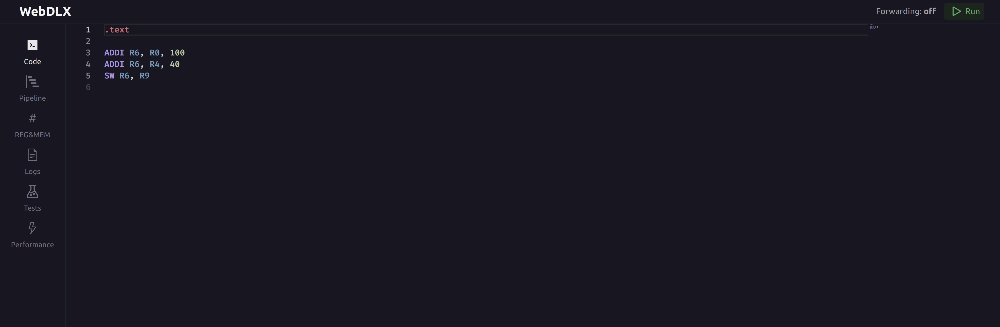
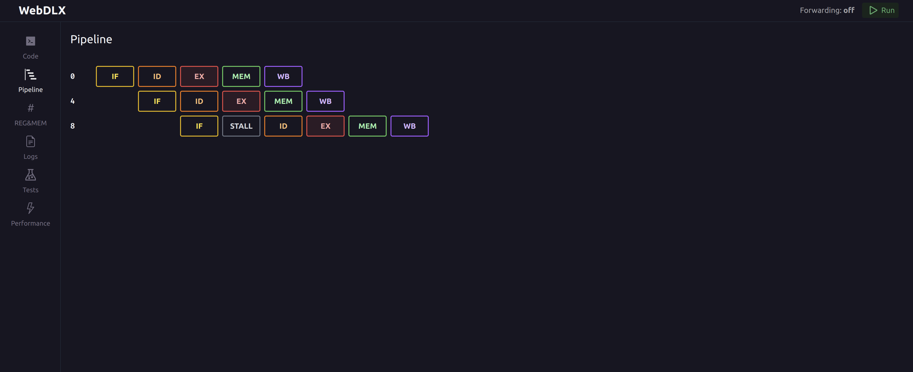
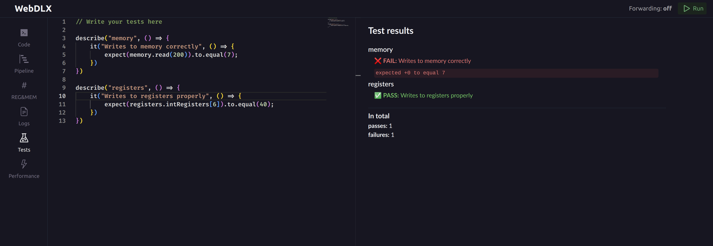

# WebDLX

:zero::one::zero::one::zero::one::zero::one::zero::one::zero::one:

Processor simulator written in TypeScript for the DLX architecture.
Inspired by WinDLX.


[See all screenshots](#screenshots)

Instructions follow WinDLX format and opcode table.

> Info: :safety_vest: Work in progress. Lots of features are missing. Only integer registers are supported. Forwarding is not yet implemented.

DLX simulator can be used as a command line tool, library or a web application.

### Motivation

Kinda related to the university course on computer architecture. This was not an assignment, just a fun project. Might abandon at any time or never finish.

Could all of that be done in a better way, with less effort or is WinDLX enough? The answer is YES! But c'mon writing own parser, assembler, getting pipeline stalls to work properly, implementing forwarding, creating in-browser unit tests editor to assert on mem and registers values, just sounds fun!

### Features:

- :art: Tired of Windows XP look? New, modern UI!
- :www: No need to install, run directly within the browser (asynchronously in a WebWorker)!
- :capital_abcd: Support for WinDLX instructions
- :nail_care: Syntax highlighting? Oh yeah, we've got that. No more NotePad++ within a VM.
- :bar_chart: Real-time pipeline visualization
- :floppy_disk: Register and memory inspection interface
- :heavy_check_mark: Write tests in JavaScript for program correctness
  - `chai.js` assertions on register/memory values
  - I'm sorry, I think it's pretty cool
- :page_with_curl: Detailed, logs
- :one: DLX assembly language assembler, including tokenizer, lexer and parser
- :mag: TODO: Profiler

### TODO:

- [ ] Implement pipeline
  - [x] Implement basic pipeline
  - [ ] Implement stalls (WIP)
  - [ ] Implement forwarding
- [x] Implement int registers
- [x] Implement basic immediate arithmetic instructions and `sw`, `lw`
- [ ] Implement memory preloading
- [ ] Implement all instructions
- [ ] Implement floating point instructions/registers
- [ ] Implement double precision instructions/registers
- [ ] Implement jumps
- [ ] Implement profiler

## Library

Library is written in TypeScript. The only runtime dependency is `nanoevents` package which contains isomorphic event emitter.

## Command line tool

```bash
pnpm tsx repl/repl.ts -s <source file>
```

## Web application

Web app is a client-side React application bundled with Vite.

```bash
pnpm install
pnpm run dev
```

## Screenshots


VSCode-like Monaco Editor with syntax highlighting:


Real-time pipeline visualization:



Tests:



## References

- [WinDLX instruction set](http://electro.fisica.unlp.edu.ar/arq/downloads/Software/WinDLX/DLXinst.html)
- [DLX architecture](https://en.wikipedia.org/wiki/DLX)
- [DLX pipeline](https://www.cs.umd.edu/~meesh/cmsc411/website/proj01/dlx/aboutDLX.html)
- [Instruction formats](https://www.cs.utexas.edu/~pingali/CS378/2015sp/lectures/DLX.pdf)
- [Building an interpreter in TypeScript](https://www.iamtk.co/series/building-an-interpreter)
